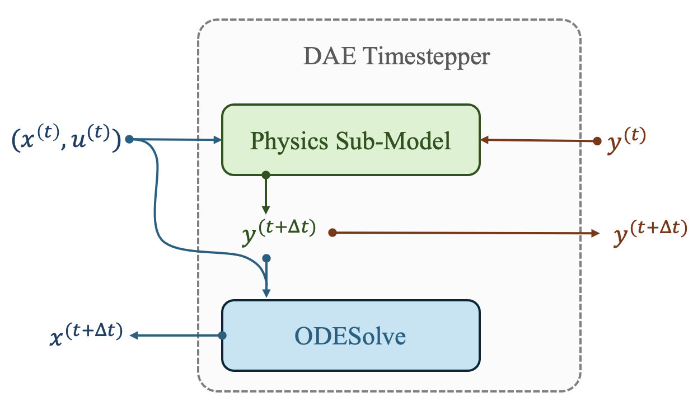

# Neural Differential Algebraic Equations

    

This is the repository for the paper titled **"Neural Differential Algebraic Equations"** by Koch et al. Neural Differential Algebraic Equations (Neural DAEs) are an extension of the canonical neural timestepper for systems with algebraic constraints. Inspired by fractional-step methods, this work leverages sequential sub-tasks to provide updates for algebraic states and differential states.

**Contained in this repository are:**
+ Neuromancer 1.4 with custom modules for DAE integration and graphical representation of physical components
+ Training and visualization scripts needed for reproducing all paper results
+ A jupyter notebook for step-by-step walkthrough of black-box and gray-box neural DAE modeling

